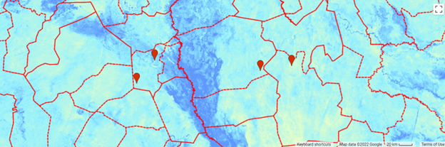

# (PART\*) Bringing RS to Survey Data {-}

```{r eval = T, echo=F}
knitr::opts_chunk$set(echo = F,
                      warning = F,
                      message = F,
                      eval=F,
                      fig.fullwidth=TRUE,out.width = "100%")
```


# Methodology

## Overview of Approach

Remote sensing data is rich both temporally and spatially, but often there is no rationale to aggregate it to administrative boundaries. Figure \@ref(fig:map-ndwiSSD) below shows NDWI across various admin 2 boundaries in SSD. The data clearly mirrors different eco-zones/environmental phenomena which change at fine spatial scales. By aggregating to a single point estimate per admin unit, the data becomes difficult to interpret. There is little rationale to hypothesize that a HHs condition would correlate to single NDWI point estimate for the region. However, it is intuitive to assume that flooding in the HHs immediate surroundings might impact their welfare. 

```{r map-ndwiSSD,eval= T,fig.cap= 'NDWI calculated around the white nile in South Sudan. Points Represent theoretical household locations'}

```

The importance of spatially explicit HH data to understand needs has been well documented as significant and important village-wise differences in mortality and nutritional outcomes have been shown to occur in the same “locality” (Tomkins et al., 1978). Mapped drivers such as drinking water supply were shown to explain significant differences in mortality rates amongst villages during the Darfur famine (De Waal, 1989).

## Method


The goal of the data pipeline for survey data was to pull environmental/climatic variables derived from remote sensing directly in the survey data set for subsequent analysis against humanitarian conditions/needs. The process can be simplified as 3 steps: 

1. coordinate anonymization
2. RS indicator construction and extraction to coordinate points
3. Integration of extracted variables back to clean data set 

## Data sharing/coordinate anonymization procedure

Spatial coordinates are included with surveys to enable and ensure quality control of assessment data. However, this data is not published or shared as it is considered sensitive information which could be used to re-identify households. However, for the remote sensing analysis/data extraction the coordinates were required. Therefore, to ensure appropriate handling of sensitive data a coordinate anonymization step was performed prior to the country team sharing the data. 

The process of anonymization is performed in the `workflow.rmd` file in the vignettes folder of the repository. Essentially the analyst loads in the data and a new random universally unique identifier (uuid) is added to the data set. The uid and the coordinates are then split into a new file contained in the `data_share` folder which was then shared with the HQ RS analyst. At the same time a lookup table containing the new old uuid and new uuid is automatically saved to the `vault` directory.

After the file in the data_share folder is shared with the HQ analyst all of the RS extraction is run on the anonymized coordinates. Once the data has been extracted to the anonymized coordinates the RS analyst sends the new file with RS parameters back to the country office who then loads that file into the second half of the workflow.rmd and joins the RS coordinates back to the clean data via the uuid lookup table.

## Data Extraction

Selected generic RS indicators were prioritized for extraction (Appendix x). These were then modified per context based on the timing of the assessment and information regarding dates/seasons that affect agriculture/livelihoods that was provided by the country teams.

Generic functions were built using the Google Earth Engine via the `{rgee}` API and `{tidyrgee}` package to extract indicators of interest with flexible input parameters. These generic functions can potentially be useful in external applications.

The targets workflow package was used to create a pipeline to perform the data extraction. Using this framework the analyst sets up a series of “targets” or function commands to do various operations, the results of these operations are saved and organized within the repository. Each time the pipeline is executed all the targets and source code is logged so that it never has to be run again if the source code is unchanged. This functionality is invaluable when running heavy data science operations for which you want a transparent and reproducible code base. As these extractions were quite heavy (on the scale of hours) this work would not have been possible to scale across so many countries without the targets work flow.

## Extraction Results and Sharing

After the RS data was extracted to each coordinate the data set was shared back to the country office to be joined back to the data set using the surveyGEER workflow.rmd. In addition to a tabular data set and RS extraction report was shared with each team. The report included displays of assessment spatial coverage,  explanations of the indicators extracted histogram/density plots of each of the indicators
