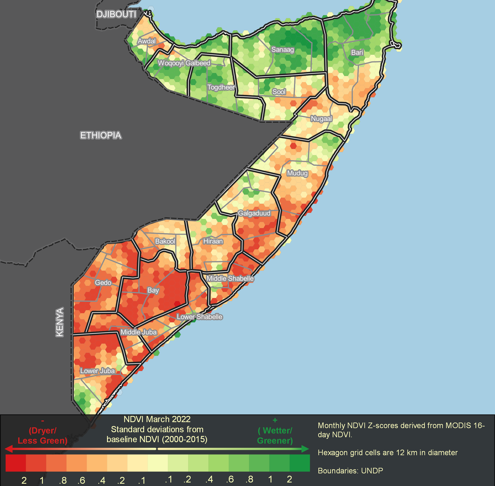
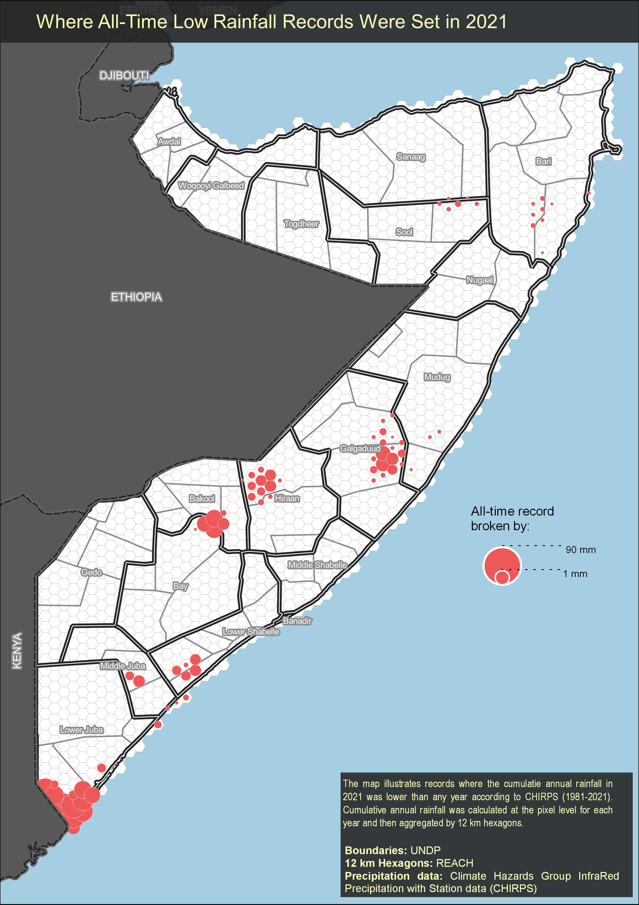
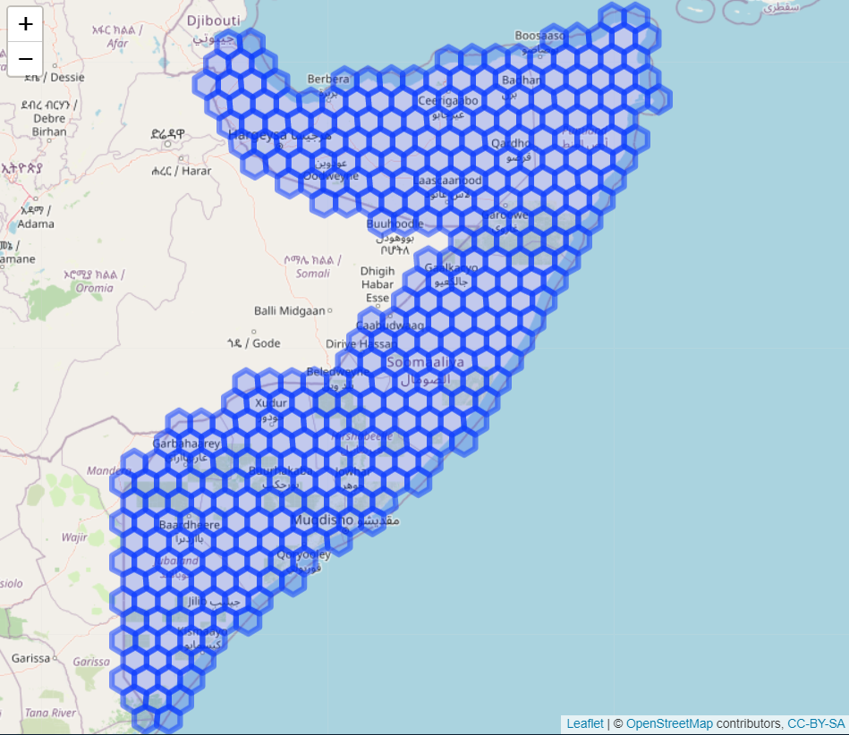

```{r, include = FALSE}
knitr::opts_chunk$set(
  collapse = TRUE,
  comment = "#>",
  eval=F,
  echo=T
)
```

# Hex Maps

Here we present a tutorial to create hexagon aggregation maps similar to the two below:

```{r map-ethNDVI,fig.cap='animated percent median ndvi aggregated to hexagon',eval= F, echo=F,results='asis'}

Percent Median NDVI (\@ref(fig:map-ethNDVI))
knitr::include_graphics(path = here::here("man/figures/eth_ndvi_pct_median_opt.gif"))
```

**NDVI Standard Score Map**
```{r, eval=T,echo=FALSE, fig.align='center', out.width='100%'}

```

**Precipitaiton Record Low Map**
```{r, eval=T,echo=FALSE, fig.align='center', out.width='100%'}

```


## NDVI Hex Maps

### Inputs/Set up Data

First we load the required libraries and modis + chirps image collections using `{rgee}`

```{r, echo=T, eval=FALSE}
library(surveyGEER)
library(rgee)
library(tidyrgee)
library(sf)
library(tidyverse)
library(leaflet)
ee_Initialize()

modis_link <- "MODIS/006/MOD13Q1"
modisIC <- ee$ImageCollection(modis_link)

```


### Generate Grid

We will use some classics from the `{sf}` to generate a grid. Generally, you would have a polygon file that you would likely load with `sf::st_read()` and then use to generate a grid over. If you are following along and and have a file you are interested in using go ahead and do that. If not, you can follow along with Somalia boundary file that is built into the `{surveyGEER}` and loaded automatically when `library(surveyGEER)` is called.

first let's quickly  view the file

```{r view_som_file, echo=T, eval=T}
som_boundary
```


- we reproject the data to utm
  +`{surveyGEER}` contains some convenience functions for re-projecting the data so you don't have to remember any coordinate system names or epsg codes. Checkout `?reach_reproject_utm()` for more details.
- We make a grid over the file. 
  + `sf::st_make_grid`  creates a grid over the entire bounding box of the `x` input. 
  + When the data is in UTM the cellsize is meters. Here we arbitrarily choose a grid diameter of 50 km.
  + set `square` to `F` to create a hexagon grid.
- clip grid to boundary file
  + To improve efficiency and reduce processing time we want to minimize the number of grid cells that we later have to perform zonal statistics/reductions on.
- For some reason the attribute where the spatial information was being stored was renamed to `x`. Let's rename it to `geometry` - **pro-tip:** this is a common gotcha with `{rgee}` - the geometry column needs to be named "geometry"


```{r, echo=T}
som_boundary_utm <- som_boundary |> 
  reach_reproject_utm(country_code = "som")

grid_utm <- st_make_grid(x = som_boundary_utm,
             cellsize = 15000,square=F) |> 
  st_as_sf()

grid_utm_clipped <- grid_utm[som_boundary_utm,] |> 
  rename(geometry="x")
```

Always good visualize the results of our code. Let's map the grid to make sure it is right. We will use `{leaflet}` which requires the data to be in the coordinate reference system of wgs 84. Therefore we will re project the data prior to mapping it in Figure \@ref(fig:map-somgrid)

```{r,echo=T}
grid_wgs84_clipped <-  st_transform(grid_utm_clipped,crs = 4326)

leaflet(grid_wgs84_clipped ) |>
  addTiles() |> 
  addPolygons() 
```

```{r map-somgrid, fig.cap= '50 km hexagon diameter grid generated for SOM', eval=T,echo=F}

```

### Image Collection Processing

MODIS NDVI should be transformed by multiplying the raster values by **0.0001**, below you can get a sense of what typical GEE/RGEE syntax looks like. For must R-users this looks a bit strange. `tidyrgee` which is shown in the following chunks simplifies a great deal of this for the end-user. Since raster math has not yet been added to to `tidyrgee` (coming soon), we will leave the the "classical" syntax below.

```{r, echo=T}
modis_ndvi <- modisIC$
  select("NDVI")$
  map(
    ee_utils_pyfunc(
      function(x){x$
          multiply(0.0001)$
          copyProperties(x,x$propertyNames())
          }
    )
  )
```

Now it's time for some actual analysis. Here is where `tidyrgee` shines and vastly simplifies the code. To use the full power of `tidyrgee` you should convert the `imageCollection` to a `tidyee` class object with the simple function `as_tidyee`. Once this has been performed it is very easy to group, filter, composite(summarise) the `imageCollection`.

To calculate a standard score (Z-score) for monthly data we first need to create a baseline. Therefore we filter the `imageCollection` to 2000-2015. Then we group that data by month and `summarise`, calculating a mean and standard deviation for each month. The result will store an `imageCollection` of 12 images (1 per month). Each image will have 2 bands the `NDVI_mean` and `NDVI_sd`. Statistics are calculated at the pixel-level for each image.

```{r, echo=T}
modis_ndvi_tidy <- as_tidyee(modis_ndvi)

monthly_baseline <- modis_ndvi_tidy |> 
  filter(year %in% 2000:2015) |> 
  group_by(month) |> 
  summarise(stat=list("mean","sd"))
```

Now that we have our baseline let's calculate the the average monthly NDVI for more recent years so that we can compare. We will first filter the `ImageCollection` to 2016-2022. Since we are working with the MODIS NDVI 16-day composite we have approximately 2 images per month. Therefore to simplify the process we should take the average NDVI value (per pixel) each month. To do this we can first `group_by(year,month)` and then call `summarise`. Remember if we just called `group_by(month)` it would return 12 images with 1 monthly average value for the entire time period of 2022-2012. By grouping by year and month we get the average monthly value for each year!

```{r, echo=T}
ndvi_recent_monthly <- modis_ndvi_tidy |> 
  filter(year %in% c(2016:2022)) |> 
  group_by(year,month) |> 
  summarise(
    stat="mean"
  )
```


Since I know I want to eventually combine the baseline stats calculated previously (`NDVI_mean`, `NDVI_sd`) with these new monthly means ,I need to rename the band produced in this new summary. By default the band_name is written as: `original band names` + `_` + `stat`. To avoid duplicate band names later when joining I will rename the band names in `ndvi_recent_monthly` from `NDVI_mean` just to `NDVI`. We can do this with the select method just by supplying a name (will be adding a pure `rename` function soon).


```{r, echo=T}
ndvi_recent_renamed <- ndvi_recent_monthly |> 
  select(NDVI="NDVI_mean")
```
  

Now we are ready to join the `ImageCollection` bands into 1 `ImageCollection`. The following inner join returns 1 `ImageCollection` storing the monthly average `NDVI` values from 2016-2022 and the long-term (baseline) monthly average and standard deviations of `NDVI`

```{r, echo=T}
ndvi_recent_and_baseline<- inner_join(x = ndvi_recent_renamed,
                                     y = monthly_baseline,
                                     by = "month")
```

Now we have all the necessary ingredients to calculate a standard score (Z-score). Below you get another opportunity to view some of trickier `rgee`/`GEE` syntax. This `expression` functionality has not yet been adapted/wrapped in `tidyrgee` (coming soon) so using the `rgee` syntax is still our only option. This is why a basic understanding of `GEE` and `rgee` is still quite handy.

`rgee` cannot handle `tidyee` classes, therefore we need to convert the object back to the `ee$ImageCollection` format `rgee` was written for. Luckily `tidyrgee` is being developed to be inter-operable with `rgee` and provides simple helper functions such as `as_ee` for this type of conversion. After running `as_ee` we have access to all the methods available in `rgee/GEE`.


```{r,echo=T}
ndvi_recent_baseline_imageCol <- ndvi_recent_and_baseline |> 
  as_ee()

ndvi_recent_baseline_imageCol$first()$bandNames()$getInfo()
ndvi_zscore<- ndvi_recent_baseline_imageCol$map(
  function(img){
    zscore<- img$expression(
      "float((NDVI-NDVI_mean)/(NDVI_sd))",
      opt_map= list(NDVI= img$select("NDVI"),
                    NDVI_mean= img$select("NDVI_mean"),
                    NDVI_sd= img$select("NDVI_sd")
      )
    )$rename("NDVI_z_score")
    img$select("NDVI","NDVI_mean")$addBands(zscore)
  }
) 
```

### Zonal stats per hexagon

`ndvi_zscore` is now an `ee$ImageCollection` class object. We can easily convert back to `tidyee` with `as_tidyee()`. However, the zonal statistics tool `ee_extract_tidy()` works on both on `ee$ImageCollection` and `tidyee`.  Just for ease of filtering and selecting let's convert it back to `tidyee`

Zonal statistics are heavery computationally expensive calculations. For example I ran the stats to calculate the median value of all 3 bands for every hexagon grid (`r nrow(grid)`) for every month in the current composite collection (76 images) and it to 160 minutes. Therefore, let's do some pre-processing so we only extract exactly what we need:

- we are only really interested in the `z_score` band so let's select that
- we are only really interested 2021 onwards so let's filter the object to everything from 2021 onwards

```{r,echo=T}
ndvi_z<- as_tidyee(ndvi_zscore)

ndvi_z_pre_processed <- ndvi_z |>
  filter(year>=2021) |>
  select("NDVI_z_score")
```


You should run `?ee_extract_tidy` to check all the optional parameters. It is important to include the scale of the image/imageCollection. If you are using a large `featureCollection` or sf spatial object you will need to adjust the `via` argument. I usually have best luck with `via="drive"`. The amount of time to perform an extraction can vary due to computations in the cloud, you must be patient.. If your grid covers the bounding box of your study area, it is probably a good idea to clip it to the area of study polygon to avoid unnecessary computations and save time.

```{r, echo=T}
grid_with_ndvi <- ndvi_z_pre_processed |> 
  ee_extract_tidy(y = grid_wgs84_clipped,stat = "mean",scale = 250,via = "drive")
```


## Chirps Hex Maps

Now let's prep the chirps data for extraction. First convert it to tidyee format so we can leverage the easy filter/summarise methods

### Load and composite Image Collection
```{r,echo=T}
chirps_link <- "UCSB-CHG/CHIRPS/DAILY"
chirps <- ee$ImageCollection(chirps_link)

chirps_tidy <- as_tidyee(chirps)
```


Let's take the entire daily record from 1981-current and extract the yearly precipitation for each year at the pixel level. Since each pixel represents daily rainfall (mm) we can just group the images by year and sum them to get annual rainfall.

```{r,echo=T}
chirps_annual_precip <- chirps_tidy |> 
  select("precipitation") |> 
  group_by(year) |> 
  summarise(
    stat="sum"
  )
```


### Zonal Reductions

Next let's again use the `ee_extract_tidy` function to extract these yearly values. Conceptually we are using our grid to perform zonal statistics on each image (1 per year). the output is a long format tidy data frame with all the median yearly values (1 per hex per year). This took about:
```{r,echo=T}
yearly_rainfall_hex <-   chirps_annual_precip |> 
  ee_extract_tidy(y = grid_wgs84_clipped,
                  stat = "median",
                  scale = 5500,
                  via = "drive")
```

### Data Wrangling

Now that we have a nice clean tidy data.frame we can go nuts with dplyr:

- We calculate the record lows (getting the 2 lowest values) for each hexagon excluding the year 2022
- we calculate how much lower the record was from the next lowest value
- Then filter to only record breaking rows that occur in 2021

```{r, echo=T}

record_lows_2021 <- yearly_rainfall_hex |> 
  # filter out 2022 since it is not yet  complete
  filter(lubridate::year(date)!=2022) |> 
  # group by grid uid
  group_by(uid) |>
  # grab two lowest annual records
  slice_min(n = 2,order_by = value) |> 
  # calculate the difference in the two lowest annual values 
  # and specify which is the lowest with T/F
  mutate(
    lower_by = max(value)- min(value),
    record_low = value==min(value)
  ) |> 
  ungroup() |> 
  # filter just the lowest record
  filter(record_low) |> 
  mutate(
    date= year(date)
  ) |> 
  #now filter just to year of interest 2021 to 
  # see where that year had all time lowest annual value on record
  filter(date==2021)
```


- We then join the 2021 record breaking records to the original clipped grid and take the centroids of all grid cells
- write output as shapefile for vizualization in QGIS.

```{r, echo=T}
# join record lows to original hex object by "uid" to make spatial again
# then filter out any hex that does not have record breaking value
# change remaining hex's to centroid points so that we can map as proportional bubbles.
record_low_centroids<- grid_wgs84_clipped |> 
  dplyr::left_join(record_lows_2021) |> 
  filter(record_low==T) |> 
  st_centroid() 

if(!is.null(write_outputs_to)){
  sf::st_write(obj = record_low_centroid,dsn = record_low_centroids,layer = "precip_record_low.shp")
}
```

### QGIS Templates

We have provided QGIS templates in the `map_templates` folder of this directory. Once the data has been extracted and save to the `data` folder in the project you should open up the either of the map templates. 

To use the map templates you must link the data sources to the layers. Once linked the symbology will automatically be set. To use these templates you should also have some layers of your own. If you put all of you GIS layers into the data folder when you link one the rest will auto-link. You should put the following layers into the data folder:

1. Admin 1 boundary (usually OCHA or UNDP)
2. Admin 2 boundary (usually OCHA or UNDP)
3. Hexagon grid (either pre-existing or created by you above)
4. NDVI layer (Hexagon output by script above)
5. Precipitation layer (point file output by script above)
6. World Adm0 boundaries - downloaded from [natural earth](https://www.naturalearthdata.com/downloads/10m-cultural-vectors/10m-admin-0-countries/)


```{r, eval=T, results="asis"}
knitr::include_graphics("man/figures/qgis_layers_panel.png")
```


```{r, eval=T, results="asis"}

knitr::include_graphics("man/figures/qgis_layers_panel.png")

```
